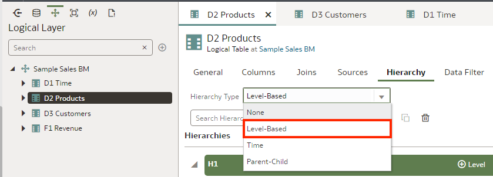
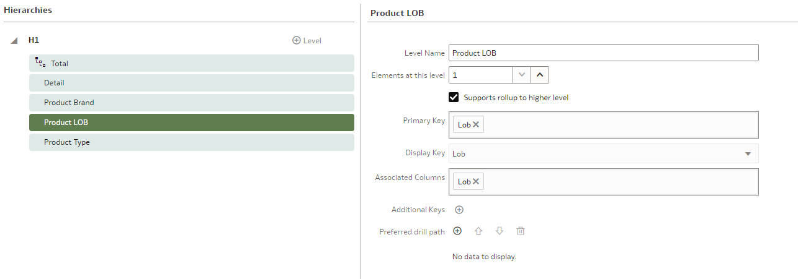
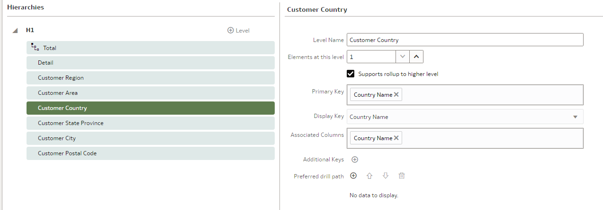
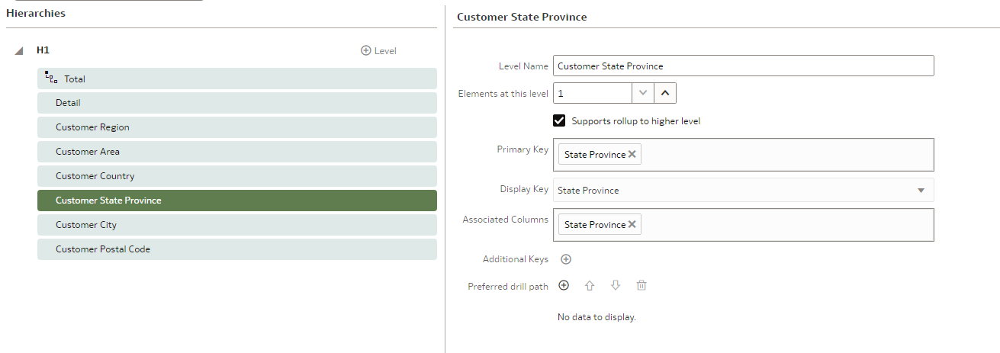
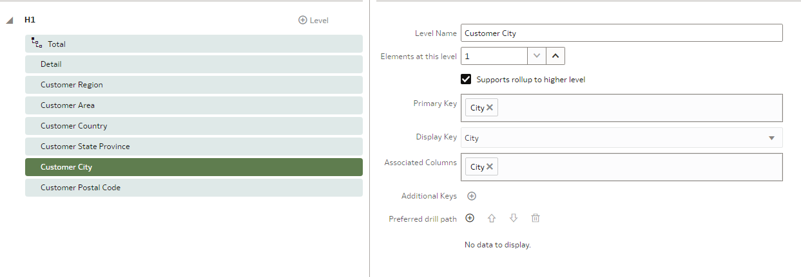
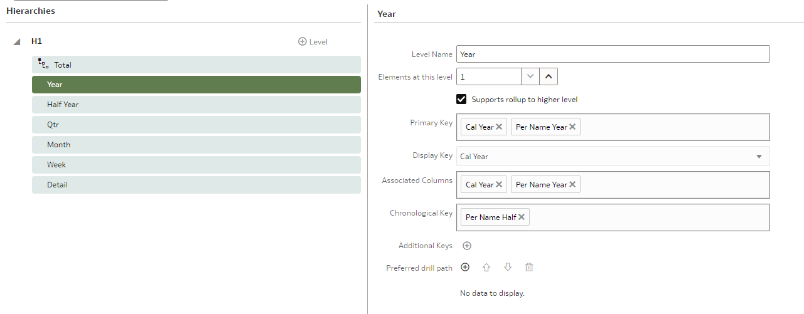
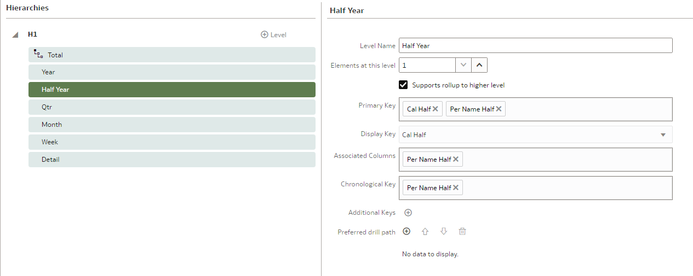
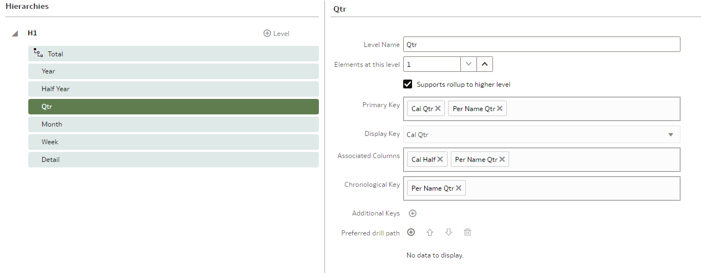
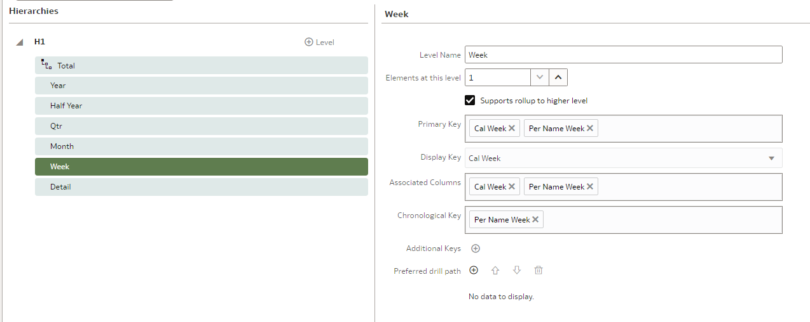

# Create Logical Hierarchies

## Introduction

This lab describes how to build governed semantic models using the Semantic Modeler.

In this lab, you continue building the Sample Sales semantic model by creating calculated, level-based, and share measures, and creating level-based and time hierarchies.

Estimated Lab Time: 25 minutes

### Objectives

In this lab, you will:
* Create level-based and time hierarchies

### Prerequisites

This lab assumes you have:
* Access to Oracle Analytics Cloud
* Access to DV Content Author, BI Data Model Author, or a BI Service Administrator role
* Access to the Sample Sales Semantic Model
* All previous labs successfully completed

## Task 1: Create a Level-based Hierarchy for Products

In the logical layer, your tables are dimension objects. The dimension object's logical columns are its attributes. You organize the columns of a dimension object into levels of a hierarchical structure.

Begin with step 3 if you're continuing this tutorial directly after completing the steps in the Manage Logical Table Sources tutorial.

1. If you closed your semantic model, sign in to Oracle Analytics Cloud using one of DV Content Author, BI Data Model Author or service administrator credentials.
    
2. On the Home page, click the **Navigator**, and then click **Semantic Models**.
    
3. In the Semantic Models page, select **Sample Sales**, click **Actions menu**, and then select **Open**.
    
4. In the Logical Layer, click **D2 Products**.
    
5. In D2 Products, click the **Hierarchy** tab. In Hierarchy Type, select **Level-Based**.
    
6. Under Hierarchies, click **Add Level**. In Level **Name,** enter <code>Product Brand</code> to replace Level-3. In the **Primary Key** and **Associated Columns fields**, select **Brand**.
    
7. Select **Product Brand** in Hierarchies, click **Add Level**. In Level **Name**, enter <code>Product LOB</code> to replace Level-4. In the **Primary Key** and **Associated Columns** fields, select **LOB**.
    
8. Select **Product LOB**, click **Add Level**. In **Level Name**, enter <code>Product Type</code> to replace Level-5. In the **Primary Key** and **Associated Columns** fields, select **Type**, and then click **Save**.
    
9. Close D2 Products.

## Task 2: Create a Level-based Hierarchy for Customers

In this section, you create a level-based hierarchy for the D3 Customers table.

1. In the Logical Layer, double-click **D3 Customers**. In D3 Customers, click the **Hierarchy** tab. In Hierarchy Type, select **Level-Based**.
    
2. Under Hierarchies, click **Add Level**. In **Level Name**, enter <code>Customer Region</code> to replace Level-3. In the **Primary Key** and **Associated Columns** fields, select **Region**.
    
3. Select **Customer Region** in Hierarchies, click **Add Level**. In **Level Name**, enter <code>Customer Area</code> to replace Level-4. In the **Primary Key** and **Associated Columns** fields, select **Area**.
    
4. Select **Customer Area** in Hierarchies, click **Add Level**. In **Level Name**, enter <code>Customer Country</code> to replace Level-5. In the **Primary Key** and **Associated Columns** fields, select **Country Name**.
    
5. Select **Customer Country** in Hierarchies, click **Add Level**. In **Level Name**, enter <code>Customer State Province</code> to replace Level-6. In the **Primary Key** and **Associated Columns** fields, select **State Province**.
    
6. Select **Customer State Province** in Hierarchies, click **Add Level**. In **Level Name**, enter <code>Customer City</code> to replace Level-7. In the **Primary Key** and **Associated Columns** fields, select **City**.
    
7. Select **Customer City** in Hierarchies, click **Add Level**. In **Level Name**, enter <code>Customer Postal Code</code> to replace Level-8. In the **Primary Key** and **Associated Columns** fields, select **Postal Code**, and then click **Save**.
    
8. Close D3 Customers.

## Task 3: Create a Time Hierarchy

In this section, you create a time hierarchy in the D1 Time logical table to use with time series functions.

1. In the Logical Layer, double-click **D1 Time**. In D1 Time, click the **Hierarchy** tab. In Hierarchy Type, select **Time**.
    
2. Under Hierarchies, click **Add Level**. In **Level Name**, enter <code>Year</code> to replace Level-3. In the **Primary Key** and **Associated Columns** fields, select **Cal Year** and **Per Name Year**. Click the **Chronological Key** field and select **Per Name Year**.
    
3. Click **Add Level**. In **Level Name**, enter <code>Half Year</code> to replace Level-4. In the **Primary Key** and **Associated Columns** fields, select **Cal Half** and **Per Name Half**. Click the **Chronological Key** field and select **Per Name Half**.
    
4. Select **Year** in Hierarchies, click **Add Level**. In **Level Name**, enter <code>Qtr</code> to replace Level-5. In the **Primary Key** and **Associated Columns** fields, select **Cal Qtr** and **Per Name Qtr**. Click the **Chronological Key** field and select **Per Name Qtr**.
    
5. Select **Qtr** in Hierarchies, click **Add Level**. In **Level Name**, enter <code>Month</code> to replace Level-6. In the **Primary Key** and **Associated Columns** fields, select **Cal Month** and **Per Name Month**. Click the **Chronological Key** field and select **Per Name Month**.
    
6. Select **Month** in Hierarchies, click **Add Level**. In **Level Name**, enter <code>Week</code> to replace Level-7. In the **Primary Key** and **Associated Columns** fields, select **Cal Week** and **Per Name Week**. Click the **Chronological Key** field and select **Per Name Week**.
    
7. Click **Save**.

8. Close D1 Time.

## Learn More
* [About Working with Logical Dimensions](https://docs.oracle.com/en/cloud/paas/analytics-cloud/acmdg/working-logical-hierarchies.html#ACMDG-GUID-9AF96F03-ABBA-43EF-80C9-A8ED6F018DE8)
* [Create Logical Time Dimensions](https://docs.oracle.com/en/cloud/paas/analytics-cloud/acmdg/model-time-series-data.html#ACMDG-GUID-8EC7B9D0-7A0D-4520-9A90-82D625518D4E)

## Acknowledgements
* **Author** - Desmond Jung, Cloud Engineer, NACI
* **Contributors** - Nagwang Gyamtso, Product Manager, Analytics Product Strategy
* **Last Updated By/Date** - Desmond Jung, July 2023
