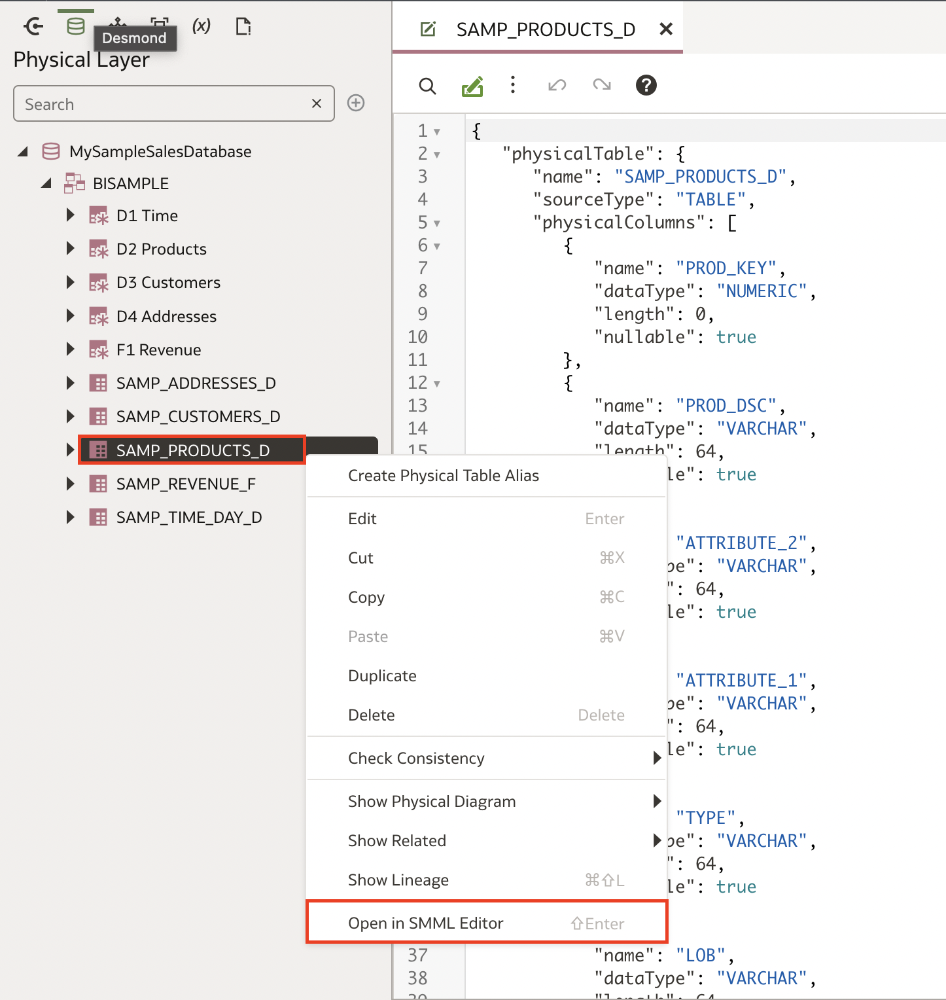
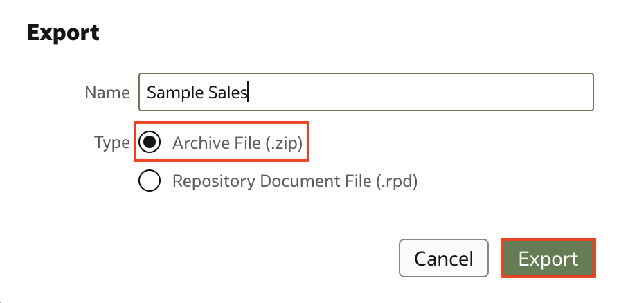
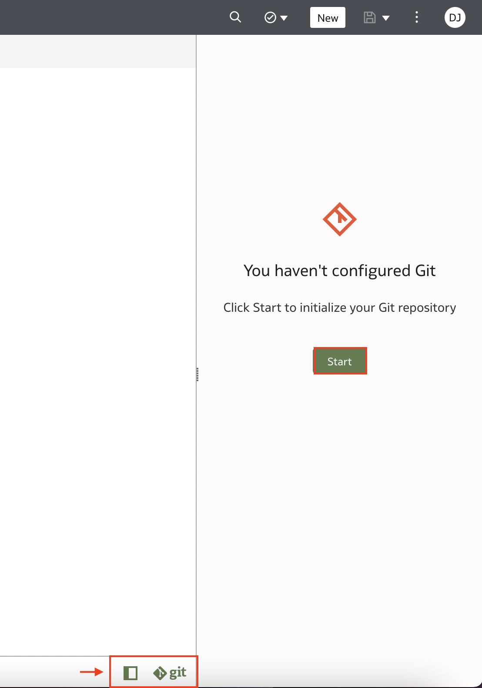
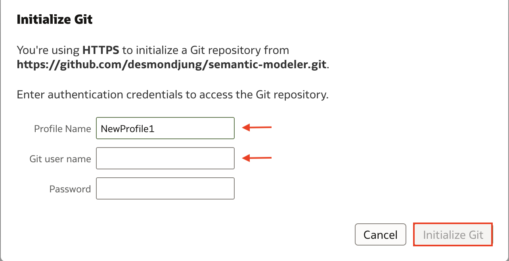

# Examine Semantic Model Markup Language

## Introduction

This tutorial shows you how to open the Semantic Model Markup Language (SMML) editor to review and make changes to a semantic model.

Estimated Lab Time: 25 minutes

### About
This lab describes how to build governed semantic models using the Semantic Modeler.

You can use Git repositories with Oracle Analytics to enable concurrent semantic modeler development.

A semantic model is comprised of a set of JavaScript Object Notation (JSON) files. When you create and develop a semantic model locally, the model's JSON files are stored in Oracle Cloud. To make the semantic model's JSON files available for other development team members, the semantic model's owner creates a Git repository, initializes it with HTTPS or SSH, and uploads the semantic model's JSON files to the repository. Each developer creates a semantic model and uses HTTPS or SSH to connect to and clone the semantic model's JSON files to their Git repository.

You can use the SMML editor to view and change the JSON SMML schema file of an object in your semantic model. If you are viewing or editing an invalid file, syntax and semantic errors are marked on the relevant line of text.

### Objectives

In this lab, you will:
* Select the objects from a supported relational data source to define the physical layer of the semantic model
* Create a schema in an empty model and add tables selected from relational data sources

### Prerequisites

This lab assumes you have:
* Access to Oracle Analytics Cloud
* Access to DV Content Author, BI Data Model Author, or a BI Service Administrator Problems
* Access to the Sample Sales Semantic Model
* Access to a Git Repository using your Github account

## Task 1: Examine the Semantic Model Markup Language

In this section, you will review JSON objects in a semantic model and makes changes to the object definitions using the Semantic Model Markup Language (SMML) editor.

Begin with step 3 if you're continuing this tutorial directly after completing the steps in Test, Deploy, and Validate a Semantic Model tutorial.

1. If you closed your semantic model, sign in to Oracle Analytics Cloud using one of DV Content Author, BI Data Model Author or service administrator credentials. On the Home page, click the **Navigator**, and then click **Semantic Models**.
	

2. In the Semantic Models page, select **Sample Sales**, click **Actions menu**, and then select **Open**.
	

3. In the Sample Sales semantic model, click the **Physical Layer**. Expand **MySampleSalesDatabase** and expand **BISAMPLE**.
	

4. Right-click **SAMP_ PRODUCTS_D**, and select **Open in SMML Editor**.

	

## Task 2: Open Your Git Repository

In this section, you use your Git repository to store your semantic model.

1. Sign in to GitHub using the URL to your repository.

2. Click **Repositories** and open the repository to use with your semantic model.
	

## Task 3: Back Up Your Semantic Model

In this section, you create an archive of your semantic model as a backup.

1. If you closed your semantic model, sign in to Oracle Analytics Cloud with your BI Data Model Author application role or service administrator credentials. On the Home page, click the **Navigator**, and then click **Semantic Models**.
	

2. In the Semantic Models page, select **Sample Sales**, click **Actions menu**, and then select **Open**.
	
	
3. In the Sample Sales semantic model, click the **Page Menu**, and select **Export**.
	

4. In Export, keep **Sample Sales** as the archive name, select **Archive File (.zip)**, and then click **Export**.
	

5. In Opening Sample Sales.zip, click **Save** and click **OK**.

6. Use the default download location or selection another location, and click **Save**.
	

## Task 4: Initialize Git Integration

In this section, you specify your profile name, Git user name, and your personal access token in the Semantic Modeler to initialize Git.

1. In the Sample Sales semantic model, click **Toggle Git Panel**, and then click **Start**.
	

2. In Initialize Git, paste your Git repository URL in to **Git Repository URL**, and then click **Continue**.
	

3. Select your Git profile, or select **New Profile**. Enter a **Profile Name**, your **Git user name**, and your personal access token in **Password**.
	
4. Click **Initialize Git**.

## Task 5: Review the Git Integration

In this section, you look at the semantic modeler content added to your Git repository.

1. In your Git repository, click the repository name, and then click **View code**.

2. Click the physical folder, click the MySampleSalesDatabaseDatabase folder, and then click the BISAMPLE schema folder to view the contents.

The BISAMPLE folder contains the JSON definitions for the physical layer's tables.

## Task 6: Change the Semantic Model

In this section, you add a description in SAMP_ PRODUCTS_D to demonstrate changes to the semantic model and how those changes are tracked in Git.

1. In the Physical Layer, double-click **SAMP_ PRODUCTS_D**. Click the **General** tab.

2. In Description, enter <code>Test product description to show semantic model changes and Git</code>. Click **Save**.

The Git panel shows the status of the changes in the semantic model.

3. In the Git panel, right-click **SAMP_ PRODUCTS_D** and select **View Diffs**.

4. Close the Diff Editor.

5. In the Git panel, click **Stage All** in Unstaged Changes. In the **commit description** field, enter a description of the changes and click **Commit**.

6. In the Git panel, click **Push**, and then click **Push**.

The message, "Push successful" appears when the changes are added to your Git repository.

7. In your Git repository, click the **Physical folder**, click **MySampleSalesDatabase**, click **BISAMPLE**, and then click **SAMP_ PRODUCTS_D.json** to view the changes made in the semantic model.

## Learn More
* [Edit Semantic Model Objects Using the SMML Editor](https://docs.oracle.com/en/cloud/paas/analytics-cloud/acmdg/edit-semantic-model-objects-using-smml-editor.html)
* [About Using Git Repositories with Semantic Modeler](https://docs.oracle.com/en/cloud/paas/analytics-cloud/acmdg/using-git-repositories-semantic-modeler.html)
* [Upload a Semantic Model to a Git Repository Using HTTPS](https://docs.oracle.com/en/cloud/paas/analytics-cloud/acmdg/upload-semantic-model-git-repository-using-https.html)
* [Work With Branches](https://docs.oracle.com/en/cloud/paas/analytics-cloud/acmdg/work-branches.html)

## Acknowledgements
* **Author** - Nagwang Gyamtso, Product Manager, Analytics Product Strategy
* **Contributors** - Desmond Jung
* **Last Updated By/Date** - Nagwang Gyamtso, February, 2023
