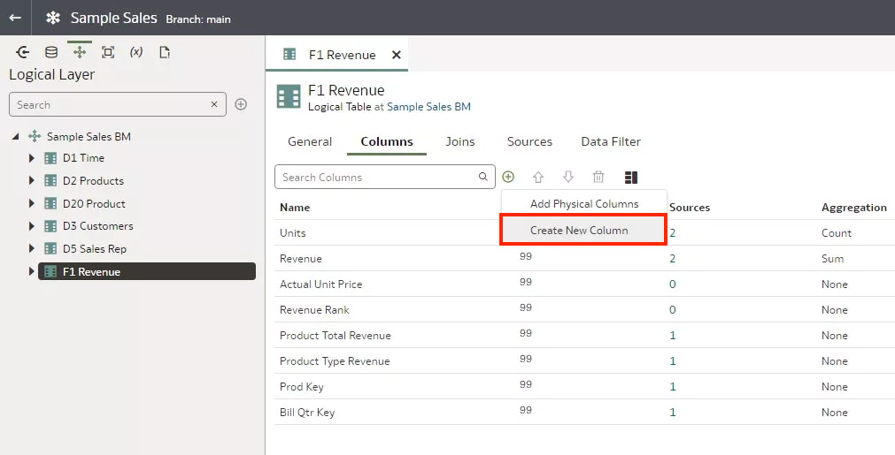
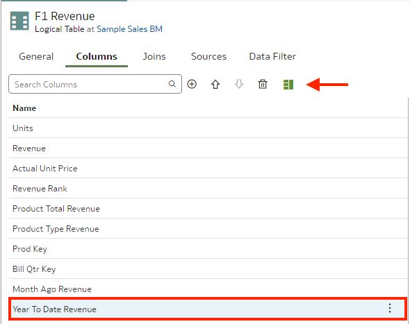
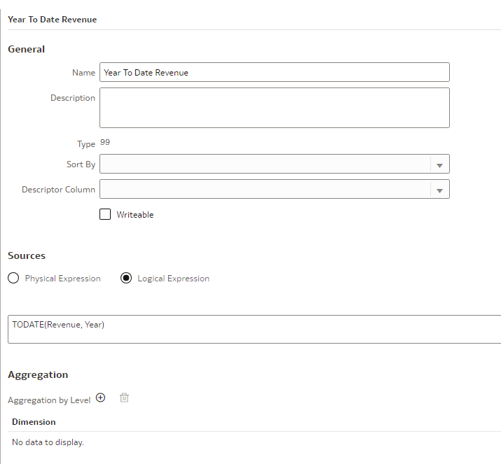
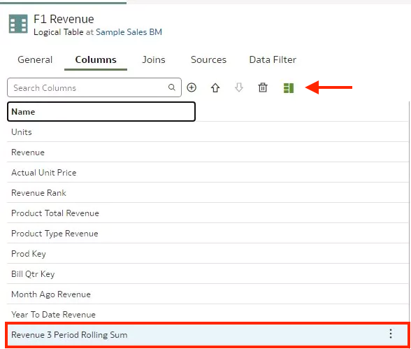

# Create Time Series Measures

## Introduction

This tutorial shows you how to create time series measures in your semantic model.

Estimated Lab Time: 25 minutes

### Objectives

In this lab, you will:
* Create time series measures in your semantic model in Oracle Analytics Cloud

### Prerequisites

This lab assumes you have:
* Access to Oracle Analytics Cloud
* Access to DV Content Author, BI Data Model Author, or a BI Service Administrator Problems
* Access to the Sample Sales Semantic Model

## Task 1: Create a Measure with the AGO Function

In this section, you create a revenue measure column that uses the AGO time series function to represent a specific past period such as a month or year.

Begin with step 3 if you're continuing this tutorial directly after completing the steps in the Create Aggregate Tables tutorial.

1. If you closed your semantic model, sign in to Oracle Analytics Cloud using one of DV Content Author, BI Data Model Author or service administrator credentials. On the Home page, click the **Navigator**, and then click **Semantic Models**.
    
2. In the Semantic Models page, select **Sample Sales**, click **Actions menu**, and then select **Open**.
    
3. In the **Logical Layer**, double-click **F1 Revenue**, and then click **Add Column**.
    
4. In **New Column_ 1**, enter <code>Month Ago Revenue</code>, and then click **Detail View**.
    
5. Under Sources, click **Logical Expressions**. Click **Open Expression Editor**.
    
6. In the Expression Editor, enter <code>Ago</code> in the search bar, and click **Search**.

7. Double-click **AGO** time series function. In the AGO expression, for **measure**, enter <code>Rev</code>, expand **F1 Revenue**, and then select **Revenue**.

8. For **time_level**, enter <code>Mon</code>, and then select the time dimension **Month**.

9. For the **number of periods**, enter <code>1</code>, click **Validate**, and then click **Save** in the Expression Editor.
    
10. Click **Save**.

## Task 2: Create a Measure with the TODATE Function

In this section, you create a revenue measure column that used the TODATE time series function to determine year to date revenue.

1. In the Logical Layer, double-click **F1 Revenue**, and then click **Add Column**.

2. In New Column_ 1, enter <code>Year To Date Revenue</code> and then click **Detail View**.
    

3. Under Sources, click **Logical Expressions**. Click **Open Expression Editor**.

4. In the Expression Editor, enter <code>To Da</code> in the search bar, and click **Search**. Double-click **TODATE**.

5. In the TODATE expression, enter <code>Rev</code> in measure, expand **F1 Revenue**, and then select **Revenue**.

6. For time_ level, enter <code>Yea</code>, and then select **Year**. Click **Validate**, and then click **Save** in the Expression Editor.
    

7. Click **Save**.
    

## Task 3: Create a Measure with the PERIODROLLING Function

In this section, you create a revenue measure column that uses the period rolling function. The starting period is 2 months in the past as represented by -2, and the ending period in 0 for the current month.

1. In the Logical Layer, double-click **F1 Revenue**, and then click **Add Column**.

2. In New Column_ 1, enter <code>Revenue 3 Period Rolling Sum</code>.
    
3. Under Sources, click **Logical Expressions**. Click **Open Expression Editor**.

4. In the Expression Editor, enter <code>Per</code> in the search bar, and then double-click **Period Rolling**.

5. In the PERIODROLLING expression, enter <code>Rev</code> in measure, expand **F1 Revenue**, and then select **Revenue**.

6. Enter <code>-2</code> in **starting_ period_ offset**. Enter <code>0</code> in **ending_ period_ offset**. Click **Validate**, and then click **Save** in the Expression Editor.
    
7. Click **Save**.

You may now **proceed to the next lab**

## Learn More
* [Model Time Series Data](https://docs.oracle.com/en/cloud/paas/analytics-cloud/acmdg/model-time-series-data.html#GUID-D390BE0D-EB9F-48EB-A686-A0AFDA12AD72)

## Acknowledgements
* **Author** - Desmond Jung, Cloud Engineer, NACI
* **Contributors** - Pravin Janardanam, Nagwang Gyamtso
* **Last Updated By/Date** - Desmond Jung, July 2023

